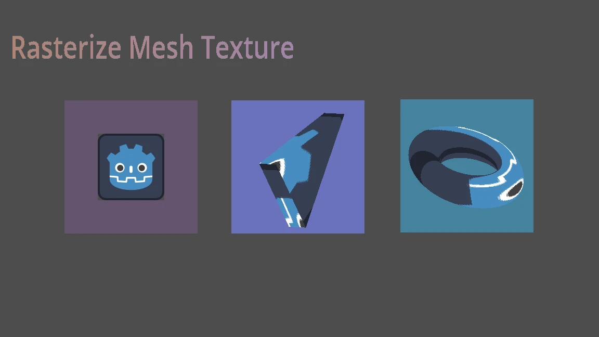

# Godot MeshTextureRd

This implements a Mesh-based Texture using the `RenderingDevice` rasterization pipeline (C#). For details, please refer to the [MeshTextureRd.cs](./MeshTextureRd.cs).

While most of the `RenderingDevice` examples are about compute pipeline, this is also a good demo to learn its graphics pipeline.
